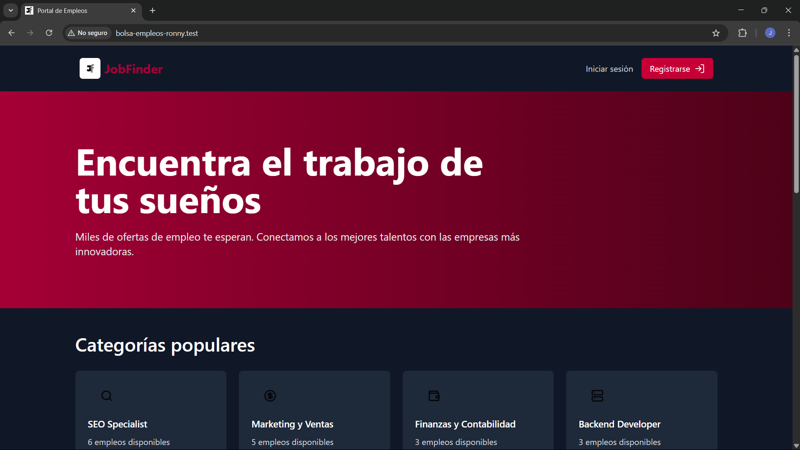

<p align="center">
  <a href="https://github.com/RonnyMeza03/tall-aplication">
    
  </a>
</p>

Esta aplicación es una plataforma de bolsa de empleos desarrollada con el objetivo de conectar a empresas que buscan talento con personas en búsqueda de nuevas oportunidades laborales. El sistema permite a los usuarios registrarse, crear perfiles, buscar ofertas de trabajo y postularse directamente a ellas.

## Requisitos

Antes de comenzar, asegúrate de tener instalado lo siguiente:

- **PHP**: Laravel 12 requiere PHP 8.1 o superior.
- **Composer**: Necesitarás Composer para gestionar las dependencias de PHP.
- **Base de datos PostgreSQL**: Asegúrate de tener PostgreSQL instalado en tu máquina o de tener acceso a un servidor PostgreSQL.
- **Node.js y npm**: Necesarios para gestionar las dependencias de JavaScript y compilar los assets.
- **Git** Para controlar el git clone del proyecto.

## Instalación

1. Clona el repositorio:
   ```bash
   git clone https://github.com/RonnyMeza03/tall-aplication.git
   ```

2. Cambia a la carpeta del proyecto clonado:
    ```bash
    cd tall-aplication
    ```

3. Instala las dependencias de PHP usando Composer:
    ```bash
    composer install
    ```

4. Crea el archivo .env a partir del archivo de ejemplo:
    ```bash
    cp .env.example .env
    ```
    
5. Genera la clave de la aplicación:
    ```bash
    php artisan key:generate
    ```

6. Configura la base de datos postgres:
    ```env
    DB_CONNECTION=pgsql
    DB_HOST=127.0.0.1
    DB_PORT=5432
    DB_DATABASE=tall-aplication
    DB_USERNAME=username
    DB_PASSWORD=password
    ```

7. Ejecuta las migraciones para crear las tablas en la base de datos:
    ```bash
    php artisan migrate
    ```

8. Ejecuta el siguiente comando para crear el enlace simbólico de almacenamiento:
    ```bash
    php artisan storage:link
    ```

9. Ejecuta los seeders:
    ```bash
    php artisan db:seed
    ```

10. Instala las dependencias de JavaScript con npm:
    ```bash
    npm install
    ```

12. Inicia el proyecto 🚩:
    ```bash
    composer run dev
    ```


Puedes buscar toda la documentación de laravel en su
[sitio web](https://laravel.com/)

## Contribuidores ✨

Gracias a estas maravillosas personas 🙂‍➡️

<table>
  <tbody>
    <tr>
      <td align="center" valign="top" width="14.28%">
        <a href="https://github.com/RonnyMeza03">
            
            <br />
            <sub><b>Ronny Meza Ascanio</b></sub>
        </a><br />
        <a href="https://github.com/RonnyMeza03" title="Bug reports">🐛</a> 
        <a href="https://github.com/RonnyMeza03" title="Code">💻</a>
        <a href="https://github.com/RonnyMeza03" title="Documentation">📖</a> 
        <a href="#example-CompuIves" title="Examples">💡</a>
        <a href="https://github.com/RonnyMeza03" title="Reviewed Pull Requests">👀</a>
      <td align="center" valign="top" width="14.28%">
        <a href="https://github.com/jmelendez07">
            <br />
            <sub><b>Jose Angel Melendez</b></sub>
        </a><br />
        <a href="https://github.com/jmelendez07" title="Code">💻</a>
        <a href="https://github.com/jmelendez07" title="Tests">⚠️</a>
        <a href="https://github.com/jmelendez07" title="Design">🎨</a>
      </td>
    </tr>
  </tbody>
</table>